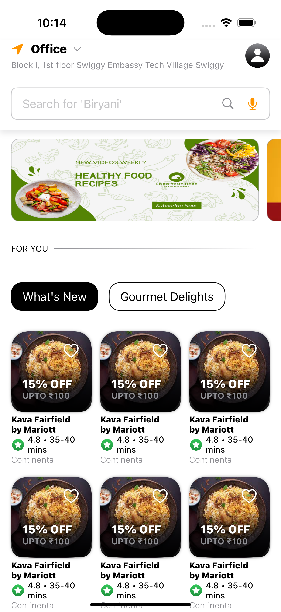
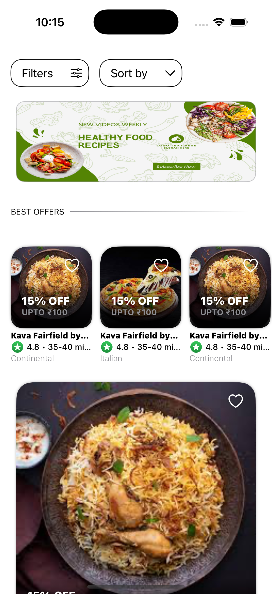
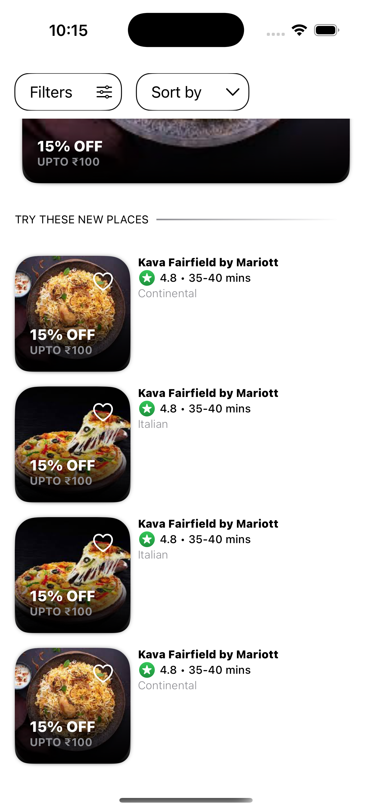

# Swiggy Alias

An iOS app with Dashboard with UI of various configuration replicating swiggy's food dashborad.

## Table of Contents

- [Previews](#previews)
- [Getting Started](#getting-started)
  - [Prerequisites](#prerequisites)
  - [Check it out yourself](#check-it-out-yourself)
- [Features](#features)

## Previews

  

## Getting Started

Setting up your project locally.

### Prerequisites

- `XCode`
- `Swift`
- `SwiftUI`

### Check it out yourself

Step-by-step guide on how to install and set up the project.

1. Clone the repository:

   ```bash
   git clone https://github.com/Aakarsh-verma/SwiggyAlias.git
   ```

2. Navigate to the project directory within terminal

   ```bash
   cd path/to/SwiggyAlias
   ```

4. Open `SwiggyAlias.xcodeproj` in **xcode** and run the project

## Features

1. **Hero Animation** on card click
2. Pull to refresh
3. Sticky Header
4. Sticky View from **middle** of ScrollView.
5. **Dynamic Grid View** with feasability to be **both Carousal and Grid** of desired size (rows and columns)
